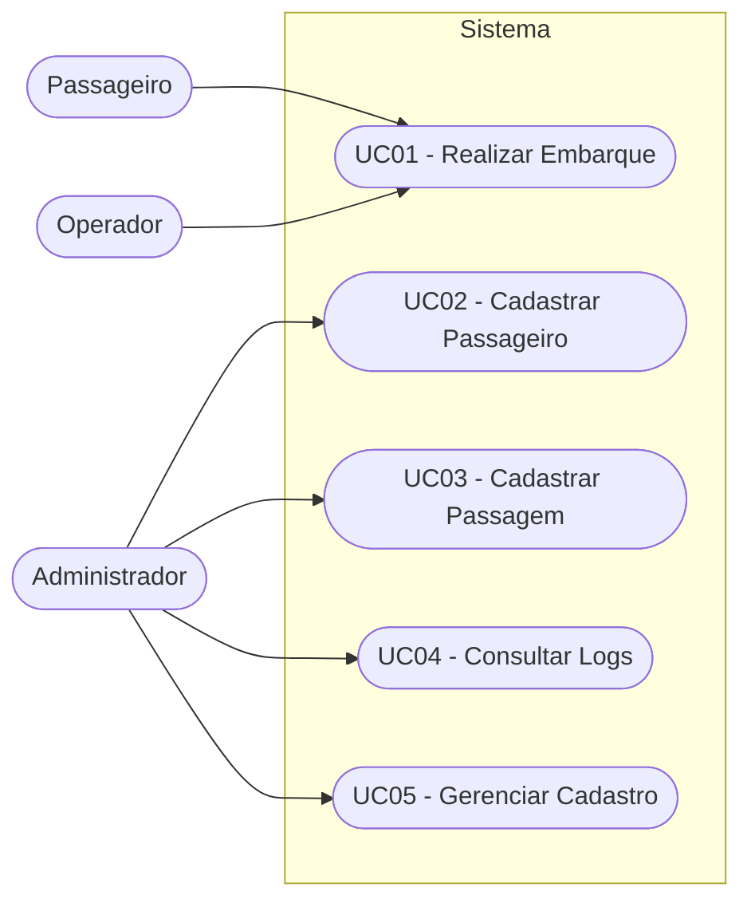
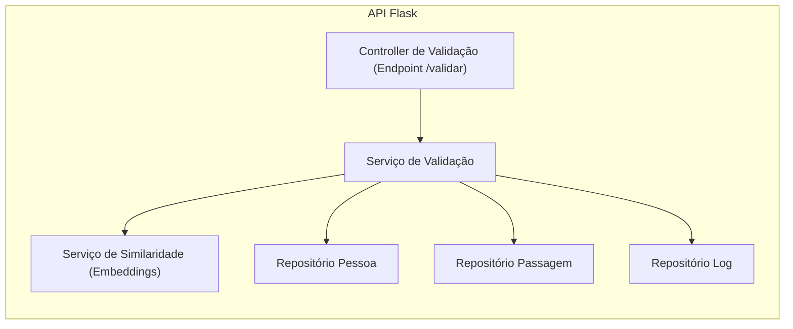
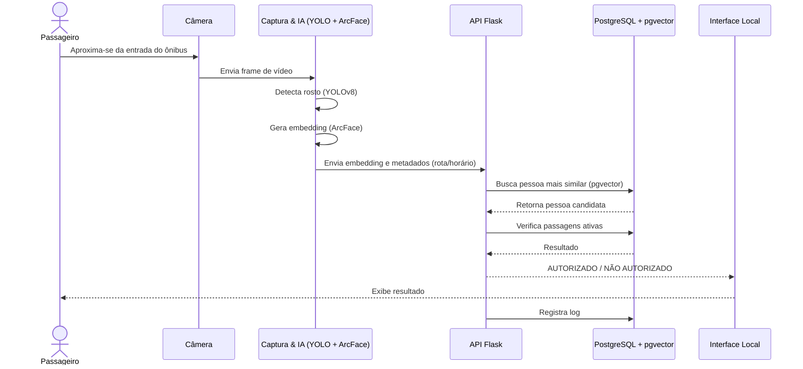
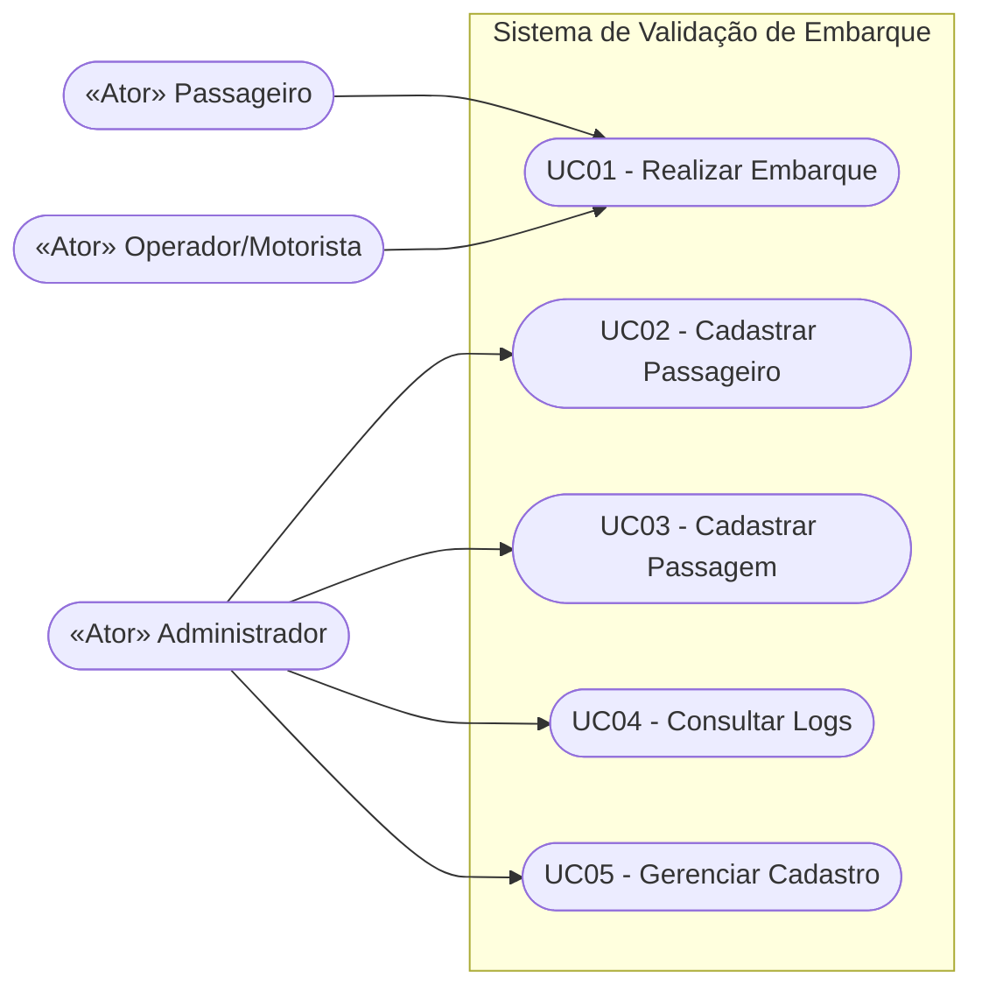
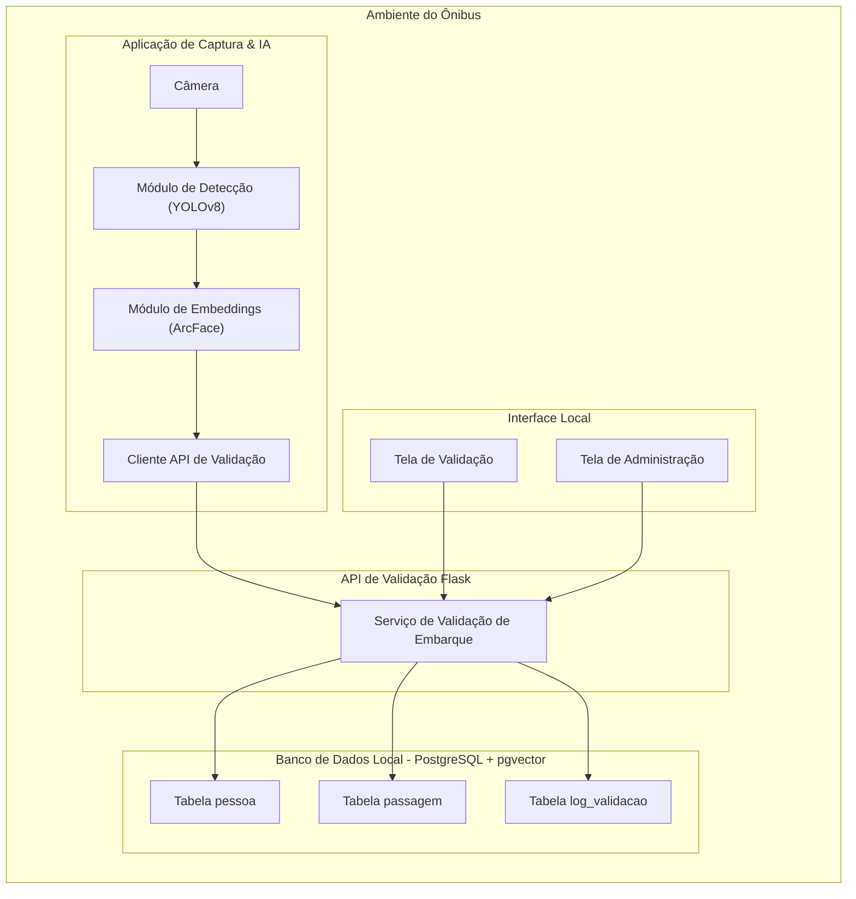
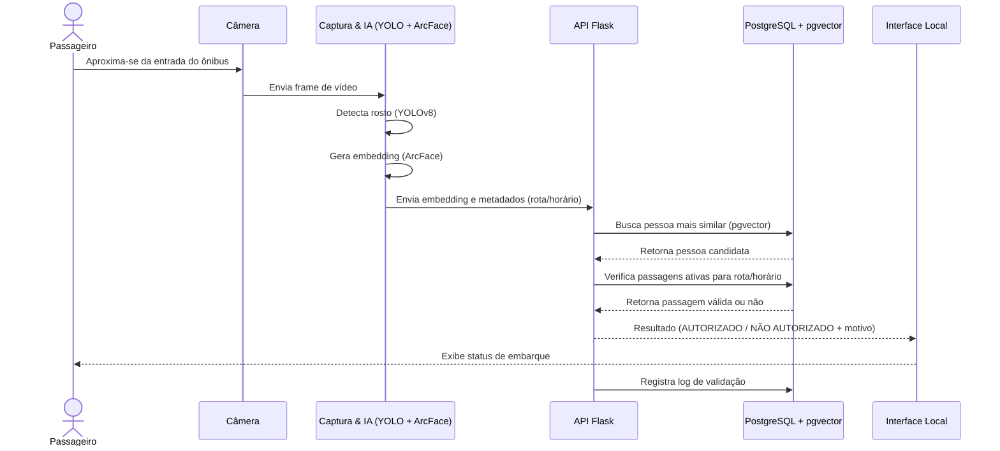

# Capa

* **Título do Projeto**: Sistema de Validação de Embarque em Ônibus por Reconhecimento Facial
* **Nome do Estudante**: Vitor Maiochi Ziehlsdorff
* **Curso**: Engenharia de Software
* **Data de Entrega**: 02/12/2025

---

# Resumo

Este documento descreve o **Request for Comments (RFC)** do projeto de Portfólio intitulado *Sistema de Validação de Embarque em Ônibus por Reconhecimento Facial*. O objetivo do projeto é desenvolver um protótipo funcional que utilize **visão computacional** e **inteligência artificial** para automatizar a validação de embarque de passageiros em ônibus, com base em **reconhecimento facial** e verificação de **passagens ativas**.

O sistema proposto integra **YOLOv8** para detecção de rostos, **ArcFace** para extração de embeddings faciais, uma **API em Flask** responsável pela lógica de negócio e validação, e um **banco de dados PostgreSQL com extensão pgvector** para armazenamento e comparação de vetores faciais. A solução é projetada para funcionar em ambiente **offline-first**, com foco em segurança, privacidade (LGPD) e possibilidade de futura implantação em hardware embarcado (como Jetson Nano ou mini-PC industrial).

O documento apresenta o contexto, motivação e objetivos do projeto, descreve o problema a ser resolvido, os requisitos funcionais e não funcionais, a arquitetura proposta, o stack tecnológico, as considerações de segurança e conformidade com normas. O projeto busca demonstrar maturidade técnica, alinhamento com demandas reais do setor de transporte público e aderência às melhores práticas de engenharia de software.

---

## 1. Introdução

### Contexto

O transporte coletivo urbano enfrenta desafios constantes relacionados à **fraude em bilhetagem**, **lentidão no embarque**, falta de **rastreamento confiável de passageiros** e necessidade de **melhorar a experiência do usuário**, mantendo custos sob controle. Atualmente, a validação de embarque é, em geral, baseada em cartões físicos (RFID) ou QR codes, o que pode gerar gargalos na entrada do ônibus, é suscetível a empréstimo indevido de cartões e depende de infraestrutura complementar.

Com o avanço de **sistemas de visão computacional** e **inteligência artificial embarcada**, surge a possibilidade de utilizar **reconhecimento facial** como uma forma segura, rápida e conveniente de validar o direito de embarque de um passageiro, reduzindo fraudes e otimizando o fluxo de entrada.

### Justificativa

Do ponto de vista de **engenharia de software**, o projeto é relevante por integrar múltiplos domínios:

* **IA / Visão Computacional**: combinação de YOLOv8 (detecção) e ArcFace (reconhecimento facial por embeddings);
* **Backend e Banco de Dados**: lógica de negócios em API Flask com persistência em PostgreSQL + pgvector;
* **Arquitetura e Segurança**: projeto com foco em privacidade (LGPD), segurança da informação e operação offline-first;
* **Aplicabilidade Real**: cenário concreto e atual do transporte público, com potencial de uso em ambientes reais.

Além disso, o projeto permite explorar boas práticas de **engenharia de software moderna**, como arquiteturas modulares, padrões de design, uso de bancos vetoriais e conformidade com normas técnicas e legais. Em termos acadêmicos, o projeto se alinha às diretrizes de Portfólio ao apresentar um produto tecnicamente desafiador, com impacto prático e espaço para evolução.

### Objetivos

#### Objetivo Geral

Desenvolver um protótipo funcional de um sistema de **validação de embarque em ônibus por reconhecimento facial**, capaz de identificar o passageiro em tempo real e verificar se ele possui uma **passagem ativa** para o veículo, rota e horário, exibindo o resultado de forma clara para o operador e registrando logs de todas as tentativas.

#### Objetivos Específicos

* Detectar rostos de passageiros em tempo real a partir de uma câmera instalada na entrada do ônibus;
* Gerar embeddings faciais utilizando ArcFace e compará-los com uma base de passageiros cadastrados;
* Manter um banco de dados com **pessoas**, **passagens ativas** e **logs de validação**;
* Validar, para cada tentativa de embarque, se a pessoa reconhecida possui passagem vigente e compatível com rota/horário;
* Exibir, em uma interface visual, o resultado da validação (OK / NÃO AUTORIZADO) e o motivo em caso de reprovação;
* Registrar todas as tentativas de embarque, incluindo confiança da identificação, pessoa reconhecida (quando aplicável) e resultado da validação;
* Projetar o sistema considerando **LGPD**, segurança da informação e boas práticas de desenvolvimento;
* Estruturar o projeto de forma extensível para futura implantação em hardware embarcado (ex.: Jetson Nano).

---

## 2. Descrição do Projeto

* **Linha de Projeto**: Projetos com IA (com forte componente IoT/Edge Computing).

* **Tema do Projeto**: Sistema de validação de embarque em ônibus utilizando reconhecimento facial, com validação de passagens ativas em banco local e exibição do resultado em interface simplificada para o operador.

* **Propósito e Uso Prático**:
  O propósito é **automatizar e tornar mais seguro e ágil** o processo de validação de embarque em ônibus. O sistema será utilizado na entrada do veículo: ao se aproximar da câmera, o passageiro terá seu rosto detectado e reconhecido; o sistema verificará se há uma passagem válida cadastrada para aquele ônibus, rota e horário, retornando **AUTORIZADO** ou **NÃO AUTORIZADO** em tela. Em um cenário real, este sistema pode complementar ou integrar-se à bilhetagem eletrônica existente.

* **Público-Alvo**:

  * Empresas de transporte coletivo urbano ou intermunicipal;
  * Órgãos gestores de mobilidade urbana;
  * Operadores de frota que desejam reduzir fraude e melhorar controle de embarques;

* **Problemas a Resolver**:

  * Reduzir **fraude na utilização de passagens**, evitando uso indevido por pessoas não autorizadas;
  * Minimizar **atritos e lentidão** na entrada do ônibus, substituindo ou complementando validação manual ou por cartão;
  * Aumentar a **segurança e rastreabilidade** do processo de embarque, com registro estruturado de tentativas;
  * Possibilitar uma **arquitetura offline-first**, independente de conectividade constante com servidores remotos;
  * Servir como base para estudo de **viabilidade de IA embarcada** em ambientes reais.

* **Diferenciação / Ineditismo**:

  * Combinação explícita de **YOLOv8 + ArcFace** para detecção e reconhecimento facial em ambiente de transporte público;
  * Foco em **validação de passagem ativa**, não apenas reconhecimento de identidade;
  * Uso de **pgvector** em PostgreSQL para armazenar e consultar embeddings, aproximando o projeto de soluções modernas de bancos vetoriais;
  * Arquitetura pensada para **offline-first**, permitindo operação mesmo sem conexão constante com a nuvem;
  * Consideração desde o início de **LGPD, ética em IA e segurança da informação** como requisitos de projeto.

* **Limitações**:

  * O protótipo não integrará, neste estágio, catracas físicas ou sistemas comerciais de bilhetagem;
  * Não haverá implementação de **liveness detection avançada** (anti-spoofing profissional), apenas medidas básicas;
  * Não está prevista, nesta fase, uma infraestrutura em nuvem ou multi-ônibus com sincronização centralizada;
  * O sistema será testado em ambiente simulado (laboratório), não em operação real com grande volume de passageiros;
  * A interface será funcional, porém simples, sem foco em design avançado ou acesso via múltiplas plataformas.

* **Normas e Legislações Aplicáveis** (visão inicial):

  * **LGPD (Lei nº 13.709/2018)**: tratamento de dados pessoais e sensíveis (biometria facial), minimização de dados, base legal para uso, segurança, transparência e direitos dos titulares;
  * **Uso de Software de Terceiros** (licenças MIT, BSD, Apache, AGPL, etc.): observância de licenças das bibliotecas utilizadas (YOLOv8, ArcFace, OpenCV, Flask, PostgreSQL, pgvector, etc.);
  * **Boas Práticas de Segurança da Informação**: OWASP Top 10 e ISO/IEC 27001 como referência para mitigação de riscos de segurança;
  * **Princípios de Ética em IA** (UNESCO, OECD AI Principles): atenção a vieses algorítmicos, transparência mínima sobre funcionamento e responsabilidade no uso de reconhecimento facial;
  * **Normas setoriais futuras**: eventual adequação, em fases posteriores, a regulamentos específicos de transporte público e uso de biometria.

* **Métricas de Sucesso** (iniciais):

  * **Tempo médio de validação** (captura → decisão): ≤ 2 segundos por tentativa;
  * **Taxa de acerto do reconhecimento facial** (identificação correta do passageiro): ≥ 95% em cenário de testes controlados;
  * **Taxa de falsos positivos** (pessoa não cadastrada sendo aceita): tão próxima de 0 quanto possível, com limiares calibrados;
  * **Disponibilidade do sistema em operação local**: ≥ 99% durante os testes em laboratório;
  * **Conformidade básica com LGPD**: evidenciada por decisões de arquitetura (ex.: uso de embeddings em vez de imagens brutas, logs sem dados sensíveis, controle de acesso à administração).

---

## 3. Especificação Técnica

### 3.1. Requisitos de Software

#### Requisitos Funcionais (RF)

* **RF01 – Captura de Imagem em Tempo Real**: O sistema deve capturar frames de vídeo de uma câmera posicionada na entrada do ônibus.
* **RF02 – Detecção de Rosto**: O sistema deve detectar, em cada frame, a presença de rostos utilizando YOLOv8 treinado ou ajustado para faces.
* **RF03 – Extração de Embeddings Faciais**: Para cada rosto detectado, o sistema deve gerar um embedding de 512 dimensões utilizando ArcFace.
* **RF04 – Cadastro de Passageiros**: O sistema deve permitir o cadastro de passageiros, incluindo nome, identificador único e embedding facial de referência (ou múltiplos embeddings).
* **RF05 – Cadastro de Passagens**: O sistema deve permitir o cadastro de passagens associadas a um passageiro, contendo rota, data, horário e validade.
* **RF06 – Validação de Embarque**: O sistema deve comparar o embedding capturado com os embeddings cadastrados e verificar se existe uma passagem ativa para o ônibus/rota/horário corrente.
* **RF07 – Exibição de Resultado**: O sistema deve exibir em tela o resultado da validação (AUTORIZADO / NÃO AUTORIZADO), bem como o motivo em caso de reprovação (sem passagem, passagem expirada, pessoa não encontrada).
* **RF08 – Registro de Logs**: O sistema deve registrar cada tentativa de validação, incluindo timestamp, passageiro reconhecido (quando houver), confiança da comparação e resultado.
* **RF09 – Consulta de Logs**: O sistema deve permitir que um usuário autorizado consulte registros de tentativas de embarque para fins de auditoria.
* **RF10 – Interface de Administração Básica**: O sistema deve disponibilizar uma interface (web simples ou desktop) para administração de passageiros e passagens (cadastro, edição, desativação).

#### Requisitos Não Funcionais (RNF)

* **RNF01 – Desempenho**: O tempo entre captura do rosto e apresentação do resultado de validação não deve exceder 2 segundos em ambiente de teste com hardware de referência.
* **RNF02 – Confiabilidade**: O sistema deve manter taxa de acerto ≥ 95% em cenário de testes controlados, com iluminação adequada e distância recomendada.
* **RNF03 – Segurança da Informação**: Dados sensíveis (embeddings, identificadores de passageiros) devem ser armazenados em banco seguro, com controle de acesso e, idealmente, criptografia em repouso.
* **RNF04 – Privacidade**: O sistema deve evitar armazenar imagens brutas desnecessárias, priorizando o uso de embeddings e respeitando princípios de minimização de dados.
* **RNF05 – Usabilidade**: A interface de validação deve ser simples, exibindo status de forma clara, legível e com uso de cores padronizadas (ex.: verde para autorizado, vermelho para não autorizado).
* **RNF06 – Portabilidade**: O sistema deve ser capaz de rodar em um PC padrão e ser projetado para futura execução em dispositivos embarcados (ex.: Jetson Nano) com mínimas adaptações.
* **RNF07 – Manutenibilidade**: O código deve ser modular, organizado em camadas e com separação clara entre captura, IA, API e persistência.
* **RNF08 – Observabilidade**: O sistema deve gerar logs estruturados suficientes para depuração, análise de falhas e melhoria contínua.

#### Representação dos Requisitos – Diagrama de Casos de Uso (UML)

#### Diagrama de Componentes da API

#### Diagrama de Sequência – Validação de Embarque

A arquitetura proposta é **modular** e pode ser descrita em blocos principais:

1. **Módulo de Captura e IA (Edge)**

   * Captura frames de vídeo da câmera (OpenCV);
   * Executa YOLOv8 para detecção de rostos;
   * Para cada rosto detectado, gera embedding com ArcFace.

2. **API de Validação (Flask)**

   * Recebe embeddings e metadados (ex.: horário, rota);
   * Consulta o banco de dados (PostgreSQL + pgvector);
   * Calcula similaridade entre embeddings;
   * Verifica se há passagem ativa para a pessoa encontrada;
   * Retorna resultado da validação (JSON) para o módulo de interface.

3. **Banco de Dados (PostgreSQL + pgvector)**

   * Tabelas principais: `pessoa`, `passagem`, `log_validacao`;
   * Armazena embeddings em campo vetorial (pgvector);
   * Permite consultas de similaridade (ex.: distância coseno).

4. **Interface Visual (UI Local)**

   * Exibe câmera ou recorte do rosto detectado;
   * Mostra resultado de validação e motivo;
   * Em modo administrador, permite cadastro básico e consulta de logs.

#### Padrões de Arquitetura

* **Arquitetura em Camadas**:

  * Camada de Apresentação: UI local (desktop ou web) e visualização de status;
  * Camada de Aplicação/Serviços: API Flask com regras de validação de embarque;
  * Camada de Domínio: entidades de pessoa, passagem, log, regras de negócio;
  * Camada de Infraestrutura: banco de dados PostgreSQL, câmera, modelos de IA.

* **Estilo Edge/Standalone**:

  * A solução é inicialmente monolítica, mas com separação lógica entre captura/IA e API, permitindo futura migração para uma arquitetura distribuída.

#### Mockups das Telas Principais (visão conceitual)

* **Tela de Validação em Tempo Real**:

  * Área principal exibindo o vídeo da câmera ou recorte do rosto detectado;
  * Indicador visual grande com texto "AUTORIZADO" (verde) ou "NÃO AUTORIZADO" (vermelho);
  * Campo opcional com nome do passageiro (quando reconhecido);
  * Campo com motivo da reprovação (ex.: "Passagem expirada");
  * Indicador de hora e rota atual.

* **Tela de Administração**:

  * Listagem de passageiros com opções de adicionar/editar/remover;
  * Formulário para cadastro de passageiro (nome, documento opcional, captura/associação de embedding);
  * Tela de cadastro de passagens (rota, data, horário, vínculo com passageiro);
  * Tela de consulta de logs com filtros por data, resultado, passageiro, rota.

Os mockups visuais poderão ser elaborados em ferramentas como Figma ou similares e incluídos como apêndice.

#### Decisões e Alternativas Consideradas

* **Detector Facial**: optou-se por YOLOv8 pela alta performance e suporte atual, em vez de detectores clássicos (Haar Cascade, HOG, MTCNN), visando maior acurácia e robustez.
* **Reconhecimento Facial**: escolheu-se ArcFace em vez de modelos mais antigos (FaceNet, OpenFace) pela qualidade dos embeddings e uso consolidado em aplicações modernas.
* **Banco de Dados**: adotou-se PostgreSQL com pgvector em vez de usar apenas arquivos ou bancos NoSQL, visando maior robustez, integridade referencial e suporte nativo a vetores.
* **Arquitetura Offline-First**: decidiu-se por operação local, sem depender de nuvem, por adequação ao cenário de ônibus em rota com conectividade intermitente.

#### Critérios de Escalabilidade, Resiliência e Segurança

* **Escalabilidade**:

  * Possibilidade de replicar a solução em múltiplos veículos, cada um com sua instância local;
  * Futuro acoplamento com servidor central para sincronização de cadastros e consolidação de logs;
  * Modularidade na separação de captura/IA e API, permitindo escalonamento independente.

* **Resiliência**:

  * Operação local mesmo sem conexão com a internet;
  * Mecanismos de tratamento de falhas (ex.: queda momentânea do banco ou da câmera) com tentativas de reconexão e mensagens claras na interface;
  * Logs detalhados para análise pós-falha.

* **Segurança** (detalhada na Seção 3.4):

  * Controle de acesso a funcionalidades administrativas;
  * Proteção de dados sensíveis em banco de dados;
  * Minimização de dados coletados e exibidos.

---

### 3.3. Stack Tecnológica

#### Linguagens de Programação

* **Python 3.x**: linguagem principal para implementação da captura de vídeo, integração com modelos de visão computacional, API Flask e interação com o banco de dados.

#### Frameworks e Bibliotecas

* **YOLOv8 (Ultralytics)**: detecção de rostos em tempo real;
* **InsightFace / ArcFace**: extração de embeddings faciais de alta qualidade;
* **OpenCV**: captura e manipulação de vídeo, pré-processamento de imagens;
* **Flask**: framework para construção da API de validação;
* **SQLAlchemy (opcional)**: ORM para interação estruturada com PostgreSQL;
* **PostgreSQL**: banco de dados relacional principal;
* **pgvector**: extensão para armazenamento e busca de vetores (embeddings faciais);
* **Tkinter ou Interface Web (HTML/CSS/JS simples)**: construção da interface visual local para operador e administrador.

#### Ferramentas de Desenvolvimento e Gestão

* **VS Code**: IDE principal de desenvolvimento;
* **Git + GitHub/GitLab**: versionamento de código e colaboração;
* **Docker (opcional)**: conteinerização da API e do banco de dados para facilitar implantação em diferentes ambientes;
* **pgAdmin**: ferramenta gráfica para administração do PostgreSQL;
* **Ferramentas de gestão de tarefas** (ex.: Jira, Trello, ou GitHub Projects): organização de backlog, marcos e atividades do projeto.

#### Licenciamento (visão geral)

* Bibliotecas e frameworks serão utilizados conforme suas licenças open source, incluindo, por exemplo:

  * YOLOv8 (Ultralytics) – licença open source específica (AGPL ou equivalente, exigir leitura atenta da documentação oficial);
  * InsightFace / ArcFace – geralmente sob licença MIT;
  * OpenCV – licença BSD;
  * Flask – licença BSD;
  * PostgreSQL – PostgreSQL License (semelhante a BSD);
  * Demais bibliotecas – licenças MIT, Apache ou equivalentes.

O projeto se compromete a:

* Não remover avisos de copyright;
* Citar as bibliotecas utilizadas na documentação e referências;
* Respeitar restrições de redistribuição e uso comercial, avaliando implicações futuras para produto real.

---

### 3.4. Considerações de Segurança

#### Riscos Identificados (iniciais)

* **R1 – Vazamento de Dados Biométricos**: acesso não autorizado ao banco contendo embeddings e dados de identificação de passageiros.
* **R2 – Ataques de Spoofing**: tentativa de enganar o sistema com fotos, vídeos ou reproduções do rosto do passageiro.
* **R3 – Injeção de Código / Requests Maliciosos**: exploração de falhas na API Flask.
* **R4 – Exposição de Logs Sensíveis**: registros contendo dados pessoais excessivos ou detalhes que permitam identificar pessoas indevidamente.
* **R5 – Acesso Administrativo Indevido**: usuários não autorizados gerenciando cadastros ou alterando passagens.

#### Medidas de Mitigação

* **M1 – Minimização de Dados**: armazenar preferencialmente embeddings em vez de imagens brutas, reduzindo o impacto de vazamentos.
* **M2 – Controle de Acesso**: proteger a interface de administração com autenticação (usuário/senha) e perfis de acesso;
* **M3 – Segurança da API**: validação de entradas, uso de padrões seguros (OWASP Top 10), limitação de origem (quando aplicável) e configuração adequada de servidor;
* **M4 – Proteção do Banco de Dados**: uso de senhas fortes, segmentação de rede (quando aplicável) e princípios de menor privilégio para usuários de banco;
* **M5 – Logs Anonimizados**: evitar logs com dados pessoais desnecessários; privilegiar IDs e informações agregadas;
* **M6 – Anti-Spoofing Básico**: implementação de verificações simples, como detecção de movimento, múltiplos frames e checagem de consistência, ainda que não seja um sistema anti-spoofing profissional.

#### Normas e Boas Práticas Seguidas

* **OWASP Top 10**: como referência para prevenir vulnerabilidades comuns em APIs e interfaces (injeção, autenticação fraca, exposição de dados, etc.);
* **ISO/IEC 27001 (como referência)**: controles gerais de segurança da informação aplicados na concepção do sistema (controle de acesso, gestão de ativos, proteção contra malware, etc.);
* **LGPD**: para tratamento de dados pessoais e sensíveis, com foco em minimização, base legal, transparência e segurança.

#### Responsabilidade Ética

Por se tratar de um sistema de **reconhecimento facial**, aspectos éticos são críticos:

* **Transparência**: informar, em contexto real, que o sistema utiliza reconhecimento facial para validação de embarque;
* **Vieses e Acurácia**: selecionar ou treinar modelos de forma a minimizar vieses relacionados a tom de pele, gênero, idade, etc.; avaliar desempenho com amostras variadas;
* **Direitos dos Usuários**: em uma implantação real, garantir meios para que o passageiro possa questionar decisões automatizadas ou optar por meios alternativos de validação, conforme LGPD;
* **Limitação de Uso**: evitar que os dados sejam utilizados para fins distintos da validação de embarque sem novo consentimento ou base legal.

Referências de ética utilizadas:

* **UNESCO – Ética em IA**;
* **OECD AI Principles** – diretrizes para IA responsável, robusta e centrada no ser humano.

---

### 3.5. Conformidade e Normas Aplicáveis

A seguir, uma síntese das principais normas e como serão observadas no projeto:

* **LGPD – Lei Geral de Proteção de Dados (Lei nº 13.709/2018)**

  * Tratar dados biométricos (rostos) como dados pessoais sensíveis;
  * Justificar claramente a finalidade (validação de embarque) e limitar o uso a essa finalidade;
  * Minimizar dados armazenados, optando por embeddings em vez de imagens brutas;
  * Proteger o acesso a dados por controle de autenticação e autorização;
  * Registrar decisões de design relacionadas à privacidade na documentação do projeto.

* **Uso de Software de Terceiros (Licenças MIT, BSD, Apache, AGPL, etc.)**

  * Listar e referenciar bibliotecas utilizadas e respectivas licenças;
  * Respeitar obrigações de atribuição e redistribuição;
  * Considerar implicações para eventual uso comercial em fase posterior do projeto.

* **OWASP Top 10**

  * Utilizar as categorias mais críticas como checklist para implementação da API e interfaces;
  * Prevenir injeção de código, falhas de autenticação, exposição de dados sensíveis, entre outros.

* **ISO/IEC 27001 (como referência de boas práticas)**

  * Adotar princípios de gestão de segurança da informação na arquitetura (controle de acesso, proteção de ativos, continuidade de operação).

* **Princípios de Ética em IA (UNESCO, OECD AI Principles)**

  * Projetar o sistema de IA com foco em robustez, segurança e respeito aos direitos humanos;
  * Evitar usos discriminatórios ou invasivos não justificados;
  * Manter transparência mínima sobre o funcionamento do sistema em contexto real.

Outras normas específicas de transporte público ou regulamentações setoriais poderão ser consideradas em fases futuras, especialmente se o projeto evoluir para implantação piloto com empresas ou órgãos públicos.

---

# 4. Próximos Passos

A seguir, são apresentados os próximos passos previstos para o desenvolvimento do projeto, considerando o estágio atual (finalização do RFC) e o fluxo esperado para Portfólio I e Portfólio II.

---

## **4.1. Portfólio I – Etapa Atual (Documentação e Planejamento)**

Nesta fase, o objetivo principal é **documentar, planejar e validar** o projeto.
Nenhuma implementação completa do sistema é exigida neste momento.

### **Atividades desta fase (Portfólio I):**

* Concluir o **RFC completo**, incluindo ajustes solicitados pelos professores avaliadores.
* Validar formalmente:

  * Problema
  * Objetivos
  * Escopo
  * Requisitos
  * Arquitetura inicial
* Produzir **diagramas UML e C4** (casos de uso, componentes, containers, sequência, etc.).
* Definir o **modelo inicial de dados** (schema conceitual em PostgreSQL + pgvector).
* Documentar considerações de:

  * LGPD
  * Ética em IA
  * Segurança da informação
  * Licenciamento das bibliotecas
* Planejar o desenvolvimento que será executado em Portfólio II.

> **Resultado esperado da fase atual:**
> RFC aprovado e projeto considerado viável para implementação prática no próximo semestre.

---

## **4.2. Portfólio II – Próxima Fase (Desenvolvimento e Testes)**

Após a aprovação do RFC, inicia-se a etapa prática do projeto.
Aqui ocorre o desenvolvimento real do sistema.

### **Atividades previstas para Portfólio II:**

#### **1. Preparação do Ambiente**

* Configurar ambiente Python (venv, dependências, requisitos).
* Configurar PostgreSQL + pgvector.
* Criar estrutura inicial do projeto (módulos, pastas, API, UI, IA).

#### **2. Implementação da Pipeline de IA**

* Implementar captura de vídeo com OpenCV.
* Implementar YOLOv8 para detecção de rostos em tempo real.
* Integrar ArcFace / InsightFace para geração de embeddings faciais.
* Testar a pipeline usando imagens de teste e depois vídeos.

#### **3. Desenvolvimento da API de Validação**

* Criar API Flask com endpoint `/validar`.
* Implementar lógica de similaridade usando pgvector.
* Implementar validação de passagem (data, horário, rota).
* Implementar persistência de logs das tentativas.

#### **4. Interface Gráfica (UI Local)**

* Criar tela de exibição de resultado da validação:

  * Autorizado (verde)
  * Não autorizado (vermelho)
  * Motivo da rejeição
* Criar painel de administração para gerenciar:

  * Passageiros
  * Passagens
  * Logs

#### **5. Integração Completa**

* Integrar pipeline de IA + API + interface.
* Realizar testes finais em fluxo real (captura → detecção → reconhecimento → validação).

#### **6. Testes e Avaliação**

* Testes funcionais e de usabilidade.
* Medições das métricas definidas:

  * Tempo de resposta
  * Acurácia
  * Taxa de falsos positivos
* Ajustes de thresholds e calibração do reconhecimento facial.

#### **7. Refinamento e Documentação Final**

* Melhorias na interface e na experiência do operador.
* Reforço de segurança e privacidade.
* Produção do relatório final + manual técnico.
* Preparação da apresentação e demonstração do sistema.

---

## 4.4. Marcos de Acompanhamento (Checkpoints)

| **Marco**                                  | **Descrição**                                                                                             | **Data Prevista** |
| ------------------------------------------ | --------------------------------------------------------------------------------------------------------- | ----------------- |
| **M1 – RFC Validado**                      | Entrega e aprovação do documento RFC completo pelos 3 professores avaliadores.                            | Dezembro/2025     |
| **M2 – Ambiente e Arquitetura Preparados** | Ambiente Python configurado, PostgreSQL + pgvector instalados, arquitetura definida e repositório criado. | Fevereiro/2025    |
| **M3 – Pipeline de IA Básica**             | Detecção facial (YOLOv8) funcionando com captura de imagem e geração de embeddings com ArcFace.           | Março/2025        |
| **M4 – API de Validação Funcional**        | API Flask com validação de embeddings, comparação vetorial e regras de passagem ativas.                   | Março/2026        |
| **M5 – Interface Local + Administração**   | UI exibindo resultado (OK/Não autorizado) e painel de administração para cadastro e logs.                 | Abril/2026        |
| **M6 – Sistema Integrado**                 | Pipeline de IA + API + UI funcionando de ponta a ponta no fluxo completo.                                 | Maio/2026         |
| **M7 – Testes Acadêmicos / Otimização**    | Testes com diferentes usuários, métricas coletadas e ajustes finais.                                      | Junho/2026        |
| **M8 – Entrega Final**                     | Relatório técnico, documentação final e demonstração prática do protótipo.                                | Julho/2026        |

---

## 5. Referências

* Ultralytics YOLOv8 – Documentação oficial
https://docs.ultralytics.com/

* InsightFace / ArcFace – Documentação oficial
https://insightface.ai/

* OpenCV – Documentação
https://docs.opencv.org/

* Flask – Framework oficial
https://flask.palletsprojects.com/

* PostgreSQL – Documentação oficial
https://www.postgresql.org/docs/

* pgvector – Extensão de vetores para PostgreSQL
https://github.com/pgvector/pgvector

* LGPD – Lei Geral de Proteção de Dados
https://www.planalto.gov.br/ccivil_03/_ato2015-2018/2018/lei/L13709.htm

* OWASP Top 10 – Boas práticas de segurança
https://owasp.org/www-project-top-ten/

* ISO/IEC 27001 – Segurança da Informação
https://www.iso.org/isoiec-27001-information-security.html

* Princípios de IA da UNESCO
https://unesdoc.unesco.org/ark:/48223/pf0000381137

* OECD AI Principles
https://oecd.ai/en/ai-principles

---

## 6. Apêndices

### Apêndice A – Diagrama de Casos de Uso (UML)

---

### Apêndice B – Diagrama de Containers (C4 – Nível 2)

---

### Apêndice C – Diagrama de Componentes (Visão Interna da API)

---

### Apêndice D – Diagrama de Sequência (Fluxo de Validação de Embarque)

---

## 7. Avaliações de Professores

### Professor(a) 1

* **Nome:**
* **Comentário/Avaliação:**
* **Nota (0 a 10):**
* **Assinatura:**

---

### Professor(a) 2

* **Nome:**
* **Comentário/Avaliação:**
* **Nota (0 a 10):**
* **Assinatura:**

---

### Professor(a) 3

* **Nome:**
* **Comentário/Avaliação:**
* **Nota (0 a 10):**
* **Assinatura:**
