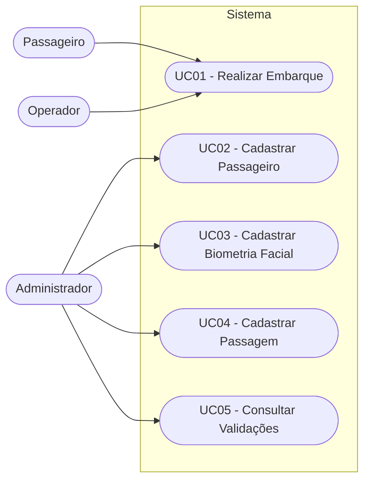
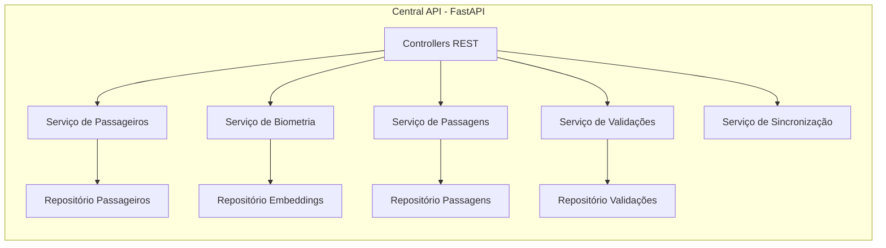
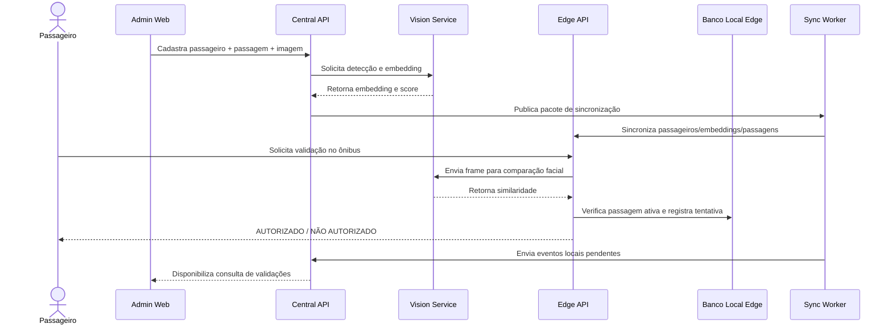
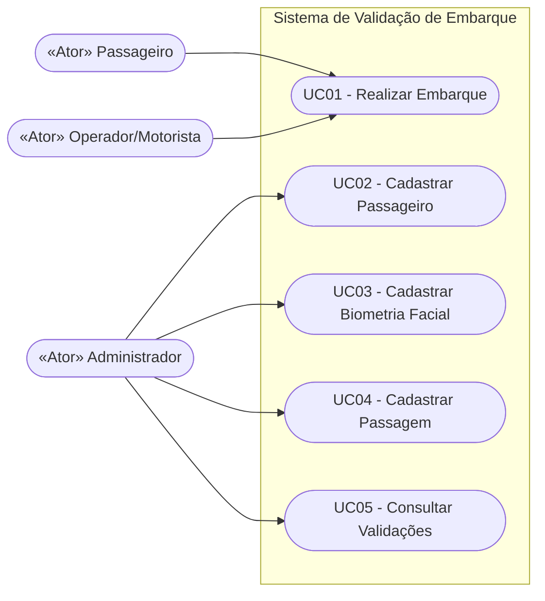
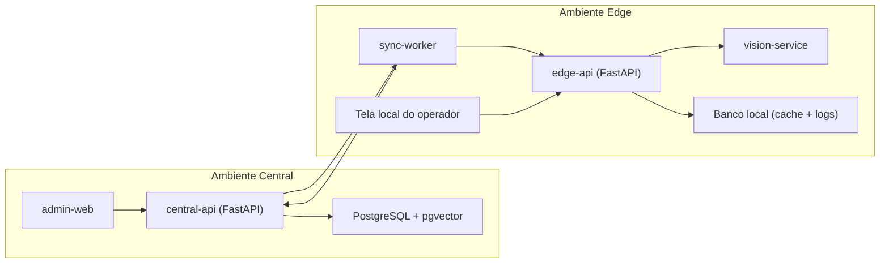
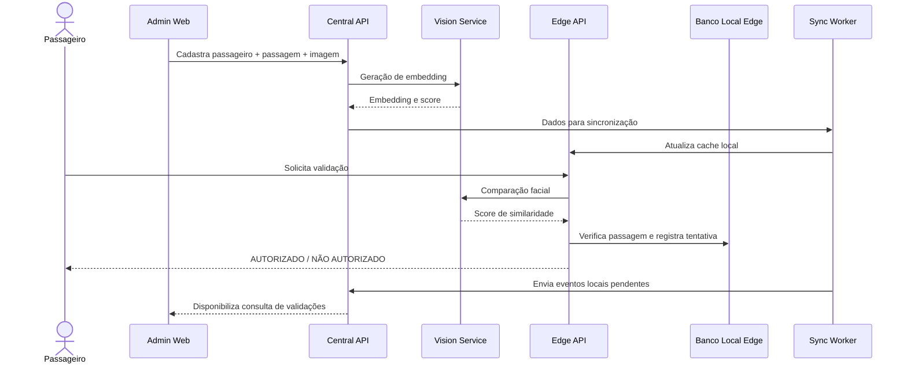

# Sistema de Validação de Embarque por Reconhecimento Facial

[](https://github.com/vitormz6/Sistema-De-Validacao-De-Embarque-Por-Reconhecimento-Facial/actions/workflows/ci.yml)

## 🚀 Acesso em Produção

| Serviço | URL |
|---|---|
| Admin Web (Painel Administrativo) | https://bfv-admin-web.up.railway.app |
| Operator Web (Validador do Ônibus) | https://operator-web.up.railway.app |
| Central API (Swagger/Docs) | https://bfv-central-api.up.railway.app/docs |
| Edge API (Swagger/Docs) | https://edge-api-production-8af2.up.railway.app/docs |
| Linktree | https://linktr.ee/vitormz5 |

## ⚡ Quick Start (local com Docker)

```bash
git clone https://github.com/vitormz6/Sistema-De-Validacao-De-Embarque-Por-Reconhecimento-Facial.git
cd Sistema-De-Validacao-De-Embarque-Por-Reconhecimento-Facial

# Sobe todos os serviços
docker compose up --build

# Roda as migrations (primeira vez)
docker compose exec central-api alembic upgrade head
docker compose exec edge-api alembic upgrade head

# Cria o primeiro administrador
docker compose exec central-api python -m scripts.seed_admin \
  --email admin@example.com --password "senha123" --name "Admin"
```

Acesse:
- Admin Web: http://localhost:5173
- Operator Web: http://localhost:5174
- Central API Docs: http://localhost:8000/docs
- Edge API Docs: http://localhost:8001/docs

## 🧪 Rodando os Testes

```bash
# Backend
cd apps/central-api && pytest
cd apps/edge-api && pytest
cd apps/vision-service && pytest
cd apps/sync-worker && pytest

# Frontend
cd apps/admin-web && npm test
```

---

# Capa (RFC)

- **Título do Projeto**: Sistema de Validação de Embarque em Ônibus por Reconhecimento Facial
- **Nome do Estudante**: Vitor Maiochi Ziehlsdorff
- **Curso**: Engenharia de Software
- **Data de Entrega**: 23/06/2026

---

# Resumo

Este documento descreve o **RFC** do projeto de Portfólio intitulado *Sistema de Validação de Embarque em Ônibus por Reconhecimento Facial*. O objetivo é definir uma arquitetura **modular e offline-first** e, ao mesmo tempo, delimitar uma **prova de conceito funcional (MVP)** viável para TCC.

O recorte de implementação contempla uma vertical slice ponta a ponta: cadastro de passageiro e biometria no **Admin Web**, geração de embedding no **vision-service**, persistência na **central-api**, sincronização para o **edge-api**, validação local sem internet, registro das tentativas no ônibus e sincronização posterior de eventos para consulta no painel administrativo.

A arquitetura de referência permanece preparada para evolução (observabilidade ampliada, controles avançados de fraude, governança de dados e expansão operacional), porém o escopo inicial prioriza entregas essenciais. O documento apresenta contexto, objetivos, requisitos, arquitetura, stack tecnológica, segurança, conformidade e plano de execução do MVP.

---

## 1. Introdução

### Contexto

O transporte coletivo urbano enfrenta desafios constantes relacionados à **fraude em bilhetagem**, **lentidão no embarque**, falta de **rastreamento confiável de passageiros** e necessidade de **melhorar a experiência do usuário**, mantendo custos sob controle. Atualmente, a validação de embarque é, em geral, baseada em cartões físicos (RFID) ou QR codes, o que pode gerar gargalos na entrada do ônibus, é suscetível a empréstimo indevido de cartões e depende de infraestrutura complementar.

Com o avanço de **sistemas de visão computacional** e **inteligência artificial embarcada**, surge a possibilidade de utilizar **reconhecimento facial** como uma forma segura, rápida e conveniente de validar o direito de embarque de um passageiro, reduzindo fraudes e otimizando o fluxo de entrada.

### Justificativa

Do ponto de vista de **engenharia de software**, o projeto é relevante por integrar múltiplos domínios:

- **IA / Visão Computacional**: detecção facial e geração/comparação de embeddings para decisão de embarque;
- **Backend e Banco de Dados**: arquitetura com FastAPI, PostgreSQL e pgvector para dados transacionais e vetoriais;
- **Arquitetura e Segurança**: separação entre módulos central e edge, com sincronização resiliente e foco em LGPD;
- **Aplicabilidade Real**: cenário concreto e atual do transporte público, com potencial de uso em ambientes reais.

Além disso, o projeto permite explorar boas práticas de **engenharia de software moderna**, como arquiteturas modulares, padrões de design, uso de bancos vetoriais e conformidade com normas técnicas e legais. Em termos acadêmicos, o projeto se alinha às diretrizes de Portfólio ao apresentar um produto tecnicamente desafiador, com impacto prático e espaço para evolução.

### Objetivos

#### Objetivo Geral

Desenvolver um MVP funcional de um sistema de **validação de embarque em ônibus por reconhecimento facial** com arquitetura modular, capaz de operar em modo offline no ambiente edge, sincronizar dados essenciais com a plataforma central e disponibilizar rastreabilidade das validações no painel administrativo.

#### Objetivos Específicos

- Permitir cadastro de passageiro no Admin Web com dados mínimos para operação;
- Realizar cadastro biométrico por upload ou captura de imagem;
- Gerar e armazenar embedding facial na plataforma central com versionamento básico do modelo;
- Cadastrar passagem simples vinculada ao passageiro;
- Sincronizar passageiros, embeddings e passagens essenciais para o ambiente edge;
- Validar embarque localmente no ônibus, inclusive sem internet, com score de similaridade e limiar configurável;
- Registrar cada tentativa de embarque no banco local do edge;
- Sincronizar eventos de validação para a central quando houver conectividade;
- Disponibilizar consulta de validações e indicadores básicos no Admin Web.

---

## 2. Descrição do Projeto

- **Linha de Projeto**: Projetos com IA aplicada e arquitetura distribuída edge/cloud.
- **Tema do Projeto**: Plataforma modular para validação de embarque por biometria facial, com operação offline-first no ônibus e sincronização com backend central.
- **Propósito e Uso Prático**:
O propósito é **automatizar e tornar mais seguro e ágil** o processo de validação de embarque, sem dependência contínua de internet. No recorte do MVP, a solução cobre uma jornada completa: cadastro no Admin Web, processamento biométrico, sincronização para o edge, validação local e consolidação posterior dos eventos no ambiente central.
- **Público-Alvo**:
  - Empresas de transporte coletivo urbano ou intermunicipal;
  - Órgãos gestores de mobilidade urbana;
  - Operadores de frota que desejam reduzir fraude e melhorar controle de embarques;
- **Problemas a Resolver**:
  - Reduzir **fraude na utilização de passagens**, evitando uso indevido por pessoas não autorizadas;
  - Minimizar **atritos e lentidão** na entrada do ônibus, substituindo ou complementando validação manual ou por cartão;
  - Aumentar a **segurança e rastreabilidade** do processo de embarque, com registro estruturado de tentativas;
  - Possibilitar uma **arquitetura offline-first**, independente de conectividade constante com servidores remotos;
  - Servir como base para estudo de **viabilidade de IA embarcada** em ambientes reais.
- **Escopo de Implementação (MVP / Prova de Conceito)**:
  - **Admin Web**: cadastro de passageiros, cadastro biométrico por upload/captura, cadastro simples de passagem, listagem de validações e dashboard básico;
  - **Central API**: módulos de passageiros, biometria, passagens, validações e sincronização básica, com autenticação simples;
  - **Vision Service**: detecção facial, geração de embedding e comparação facial com score de similaridade;
  - **Edge API**: cache local de passageiros/embeddings/passagens, validação offline, registro local de tentativas e endpoint de status;
  - **Sync Worker**: sincronização assíncrona de dados essenciais e eventos de validação com retentativa.
- **Diferenciação / Ineditismo**:
  - Arquitetura modular com responsabilidades claras entre `admin-web`, `central-api`, `edge-api`, `vision-service` e `sync-worker`;
  - Foco em **vertical slice implementável** para TCC, evitando escopo excessivo e preservando valor técnico;
  - Operação **offline-first** com sincronização assíncrona baseada em outbox pattern;
  - Uso de **pgvector** em PostgreSQL para consultas de similaridade facial de forma aderente ao estado da prática;
  - Tratamento de privacidade e segurança desde a fase de desenho arquitetural.
- **Limitações**:
  - O MVP será validado em ambiente controlado de laboratório, com premissas operacionais simplificadas;
  - O escopo funcional prioriza cadastro, validação e sincronização básica, sem cobertura gerencial completa;
  - Controles avançados de antifraude e governança ampliada ficam para evolução arquitetural posterior;
  - A interface administrativa será objetiva, com foco em operação do fluxo de ponta a ponta;
  - O modelo de sincronização será eventual-consistente, sem estratégias avançadas de reconciliação nesta etapa.
- **Normas e Legislações Aplicáveis** (visão inicial):
  - **LGPD (Lei nº 13.709/2018)**: tratamento de dados pessoais e sensíveis (biometria facial), minimização de dados, base legal para uso, segurança, transparência e direitos dos titulares;
  - **Uso de Software de Terceiros** (licenças MIT, BSD, Apache, AGPL, etc.): observância de licenças das bibliotecas utilizadas (SCRFD/ArcFace, OpenCV, FastAPI, PostgreSQL, pgvector, etc.);
  - **Boas Práticas de Segurança da Informação**: OWASP Top 10 e ISO/IEC 27001 como referência para mitigação de riscos de segurança;
  - **Princípios de Ética em IA** (UNESCO, OECD AI Principles): atenção a vieses algorítmicos, transparência mínima sobre funcionamento e responsabilidade no uso de reconhecimento facial;
  - **Normas setoriais futuras**: eventual adequação, em fases posteriores, a regulamentos específicos de transporte público e uso de biometria.
- **Métricas de Sucesso** (iniciais):
  - **Tempo médio de validação local** (captura → decisão no edge): ≤ 2 segundos por tentativa;
  - **Taxa de identificação correta** em ambiente de teste controlado: ≥ 95%, com limiar calibrado;
  - **Taxa de sincronização de eventos** (eventos locais entregues à central): ≥ 99% no período de teste;
  - **Disponibilidade operacional local** do edge durante ensaios: ≥ 99%;
  - **Rastreabilidade das validações**: 100% das tentativas com registro local e status de sincronização.

---

## 3. Especificação Técnica

### 3.1. Requisitos de Software

#### Requisitos Funcionais (RF)

- **RF01 – Cadastro de Passageiro (Admin Web)**: O sistema deve permitir cadastro de passageiro com dados mínimos de identificação.
- **RF02 – Cadastro Biométrico**: O Admin Web deve permitir upload ou captura de imagem facial para cadastro biométrico.
- **RF03 – Geração de Embedding**: A central deve acionar o `vision-service` para detectar face e gerar embedding facial.
- **RF04 – Persistência Central**: O sistema deve armazenar passageiro, passagem e embedding na `central-api`/PostgreSQL.
- **RF05 – Cadastro de Passagem Simples**: O sistema deve permitir vincular uma passagem ativa ao passageiro.
- **RF06 – Sincronização para Edge**: O sistema deve disponibilizar sincronização dos dados essenciais (passageiros, embeddings e passagens) para o `edge-api`.
- **RF07 – Validação Offline no Ônibus**: O `edge-api` deve validar embarque localmente, incluindo operação sem conectividade.
- **RF08 – Integração com Vision Service no Edge**: O `edge-api` deve consultar o `vision-service` para comparação facial e score de similaridade.
- **RF09 – Registro Local de Tentativas**: Cada tentativa de embarque deve ser registrada no banco local com status, score, motivo e carimbo temporal.
- **RF10 – Sincronização de Eventos**: O `sync-worker` deve enviar eventos locais para a central com retentativa em caso de falha.
- **RF11 – Confirmação de Sincronização**: Eventos enviados e confirmados devem ser marcados como sincronizados.
- **RF12 – Consulta de Validações no Admin Web**: O Admin Web deve listar validações consolidadas recebidas pela central.
- **RF13 – Dashboard Operacional Básico**: O Admin Web deve apresentar indicadores básicos de validações autorizadas/negadas e pendências de sincronização.
- **RF14 – Endpoint de Status Edge**: O `edge-api` deve expor status de saúde operacional (API, banco local e sincronização).

#### Requisitos Não Funcionais (RNF)

- **RNF01 – Desempenho**: O tempo de validação local (captura até decisão) não deve exceder 2 segundos no ambiente de teste definido.
- **RNF02 – Confiabilidade**: A identificação deve atingir desempenho mínimo de referência em cenário controlado, com limiares documentados.
- **RNF03 – Segurança da Informação**: APIs e dados biométricos devem possuir controle de acesso, segregação por responsabilidades e proteção de credenciais.
- **RNF04 – Privacidade**: O sistema deve priorizar armazenamento de embeddings e evitar retenção desnecessária de imagens.
- **RNF05 – Usabilidade**: As interfaces de operador e administração devem ser objetivas, com feedback claro de autorização/negação e motivos.
- **RNF06 – Operação Offline-First**: O edge deve continuar validando embarque sem internet e sincronizar de forma assíncrona quando reconectado.
- **RNF07 – Manutenibilidade**: A solução deve manter separação modular entre `admin-web`, `central-api`, `edge-api`, `vision-service` e `sync-worker`.
- **RNF08 – Observabilidade Básica**: O sistema deve registrar eventos estruturados de validação e sincronização para suporte técnico e avaliação acadêmica.

#### Representação dos Requisitos – Diagrama de Casos de Uso (UML)




#### Diagrama de Componentes da API




#### Diagrama de Sequência – Validação de Embarque




A arquitetura proposta é **modular** e pode ser descrita em blocos principais (arquitetura de referência), com recorte implementável no MVP:

1. **Admin Web**
  - Cadastro de passageiros;
  - Cadastro biométrico por upload/captura;
  - Cadastro simples de passagens;
  - Consulta de validações e dashboard básico.
2. **Central API (FastAPI)**
  - Módulos de passageiros, biometria, passagens, validações e sincronização básica;
  - Persistência em PostgreSQL com suporte a pgvector;
  - Exposição de APIs para administração, ingestão de eventos e distribuição de dados para o edge.
3. **Vision Service**
  - Detecção facial;
  - Geração de embeddings;
  - Comparação facial com retorno de score/similaridade;
  - Preparado para evolução com mecanismos avançados de anti-spoofing.
4. **Edge API**
  - Cache local de passageiros, embeddings e passagens;
  - Validação offline de embarque;
  - Registro local das tentativas de validação;
  - Endpoints de status operacional e integração com `vision-service`.
5. **Sync Worker**
  - Sincronização assíncrona com outbox pattern;
  - Envio de eventos de validação do edge para a central;
  - Recebimento de dados essenciais da central para o edge;
  - Retentativa e marcação de eventos sincronizados.

#### Padrões de Arquitetura

- **Arquitetura em Camadas**:
  - Camada de Apresentação: Admin Web e tela operacional local;
  - Camada de Aplicação/Serviços: APIs central e edge, além do sync worker;
  - Camada de Domínio: passageiros, biometria, passagens, validações e sincronização;
  - Camada de Infraestrutura: PostgreSQL/pgvector, banco local, câmera e modelos de IA.
- **Estilo Edge + Central (Offline-First)**:
  - A decisão de embarque ocorre no edge, com sincronização eventual para a central;
  - O desenho reduz impacto de conectividade intermitente e mantém rastreabilidade operacional;
  - A evolução arquitetural prevê ampliação de governança, observabilidade e antifraude.

#### Mockups das Telas Principais (visão conceitual)

- **Tela Operacional no Ônibus**:
  - Indicador visual grande com texto "AUTORIZADO" (verde) ou "NÃO AUTORIZADO" (vermelho);
  - Exibição de score/similaridade e motivo da decisão;
  - Indicador de modo online/offline e status de sincronização local.
- **Tela de Administração (MVP)**:
  - Cadastro de passageiro;
  - Cadastro biométrico por upload/captura;
  - Cadastro simples de passagem;
  - Listagem de validações e indicadores operacionais básicos.

Os mockups visuais poderão ser elaborados em ferramentas como Figma ou similares e incluídos como apêndice.

#### Decisões e Alternativas Consideradas

- **Detector Facial**: adoção de detector dedicado para faces (ex.: SCRFD) para manter robustez e desempenho no fluxo operacional.
- **Reconhecimento Facial**: escolha por ArcFace/InsightFace devido à qualidade dos embeddings e aderência ao cenário de comparação vetorial.
- **Banco de Dados**: PostgreSQL + pgvector no central para consistência transacional e busca por similaridade.
- **Estratégia de Sincronização**: uso de outbox pattern para robustez em rede intermitente sem acoplamento forte entre edge e central.
- **Recorte MVP**: priorização de uma jornada funcional completa em vez de cobertura total da plataforma ideal.

#### Critérios de Escalabilidade, Resiliência e Segurança

- **Escalabilidade**:
  - Replicação por veículo com edge independente e sincronização assíncrona;
  - Evolução para múltiplos operadores e maior volume transacional na central;
  - Escalonamento independente de serviços de API, visão computacional e sincronização.
- **Resiliência**:
  - Operação local no ônibus mesmo sem conectividade externa;
  - Retentativas automáticas no sincronismo de eventos;
  - Endpoints de status e logs estruturados para diagnóstico.
- **Segurança** (detalhada na Seção 3.4):
  - Controle de acesso a funcionalidades administrativas;
  - Proteção de dados sensíveis em banco de dados;
  - Minimização de dados coletados e exibidos.

---

### 3.3. Stack Tecnológica

#### Linguagens de Programação

- **Python 3.x**: linguagem principal de `central-api`, `edge-api`, `vision-service` e `sync-worker`.
- **TypeScript**: linguagem principal do `admin-web`.

#### Frameworks e Bibliotecas

- **FastAPI**: framework principal para APIs central e edge;
- **SQLAlchemy**: ORM para persistência relacional;
- **Alembic**: controle de migrações de schema;
- **PostgreSQL**: banco relacional principal;
- **pgvector**: armazenamento e busca por embeddings faciais;
- **OpenCV**: captura e pré-processamento de imagem no fluxo de visão;
- **InsightFace / ArcFace**: geração de embeddings faciais;
- **Detector facial dedicado (ex.: SCRFD)**: detecção de face para cadastro e validação;
- **React + TypeScript**: construção do `admin-web`.

#### Ferramentas de Desenvolvimento e Gestão

- **VS Code**: IDE principal de desenvolvimento;
- **Git + GitHub/GitLab**: versionamento de código e colaboração;
- **Docker Compose**: orquestração local dos serviços do MVP;
- **pgAdmin**: ferramenta gráfica para administração do PostgreSQL;
- **Ferramentas de gestão de tarefas** (ex.: Jira, Trello, ou GitHub Projects): organização de backlog, marcos e atividades do projeto.

#### Licenciamento (visão geral)

- Bibliotecas e frameworks serão utilizados conforme suas licenças open source, incluindo, por exemplo:
  - Modelos de visão computacional (SCRFD/ArcFace) – licenças conforme distribuição adotada no projeto;
  - InsightFace / ArcFace – geralmente sob licença MIT;
  - OpenCV – licença BSD;
  - FastAPI – licença MIT;
  - PostgreSQL – PostgreSQL License (semelhante a BSD);
  - Demais bibliotecas – licenças MIT, Apache ou equivalentes.

O projeto se compromete a:

- Não remover avisos de copyright;
- Citar as bibliotecas utilizadas na documentação e referências;
- Respeitar restrições de redistribuição e uso comercial, avaliando implicações futuras para produto real.

---

### 3.4. Considerações de Segurança

#### Riscos Identificados (iniciais)

- **R1 – Vazamento de Dados Biométricos**: acesso não autorizado ao banco contendo embeddings e dados de identificação de passageiros.
- **R2 – Ataques de Spoofing**: tentativa de enganar o sistema com fotos, vídeos ou reproduções do rosto do passageiro.
- **R3 – Injeção de Código / Requests Maliciosos**: exploração de falhas nas APIs central e edge.
- **R4 – Exposição de Logs Sensíveis**: registros contendo dados pessoais excessivos ou detalhes que permitam identificar pessoas indevidamente.
- **R5 – Acesso Administrativo Indevido**: usuários não autorizados gerenciando cadastros ou alterando passagens.

#### Medidas de Mitigação

- **M1 – Minimização de Dados**: armazenar preferencialmente embeddings em vez de imagens brutas, reduzindo o impacto de vazamentos.
- **M2 – Controle de Acesso**: proteger a interface de administração com autenticação (usuário/senha) e perfis de acesso;
- **M3 – Segurança da API**: validação de entradas, uso de padrões seguros (OWASP Top 10), limitação de origem (quando aplicável) e configuração adequada de servidor;
- **M4 – Proteção do Banco de Dados**: uso de senhas fortes, segmentação de rede (quando aplicável) e princípios de menor privilégio para usuários de banco;
- **M5 – Logs Anonimizados**: evitar logs com dados pessoais desnecessários; privilegiar IDs e informações agregadas;
- **M6 – Anti-Spoofing Inicial**: aplicação de regras básicas de consistência para reduzir falsos aceites no MVP; a arquitetura prevê evolução para mecanismos avançados de liveness em etapas futuras.

#### Normas e Boas Práticas Seguidas

- **OWASP Top 10**: como referência para prevenir vulnerabilidades comuns em APIs e interfaces (injeção, autenticação fraca, exposição de dados, etc.);
- **ISO/IEC 27001 (como referência)**: controles gerais de segurança da informação aplicados na concepção do sistema (controle de acesso, gestão de ativos, proteção contra malware, etc.);
- **LGPD**: para tratamento de dados pessoais e sensíveis, com foco em minimização, base legal, transparência e segurança.

#### Responsabilidade Ética

Por se tratar de um sistema de **reconhecimento facial**, aspectos éticos são críticos:

- **Transparência**: informar, em contexto real, que o sistema utiliza reconhecimento facial para validação de embarque;
- **Vieses e Acurácia**: selecionar ou treinar modelos de forma a minimizar vieses relacionados a tom de pele, gênero, idade, etc.; avaliar desempenho com amostras variadas;
- **Direitos dos Usuários**: em uma implantação real, garantir meios para que o passageiro possa questionar decisões automatizadas ou optar por meios alternativos de validação, conforme LGPD;
- **Limitação de Uso**: evitar que os dados sejam utilizados para fins distintos da validação de embarque sem novo consentimento ou base legal.

Referências de ética utilizadas:

- **UNESCO – Ética em IA**;
- **OECD AI Principles** – diretrizes para IA responsável, robusta e centrada no ser humano.

---

### 3.5. Conformidade e Normas Aplicáveis

A seguir, uma síntese das principais normas e como serão observadas no projeto:

- **LGPD – Lei Geral de Proteção de Dados (Lei nº 13.709/2018)**
  - Tratar dados biométricos (rostos) como dados pessoais sensíveis;
  - Justificar claramente a finalidade (validação de embarque) e limitar o uso a essa finalidade;
  - Minimizar dados armazenados, optando por embeddings em vez de imagens brutas;
  - Proteger o acesso a dados por controle de autenticação e autorização;
  - Registrar decisões de design relacionadas à privacidade na documentação do projeto.
- **Uso de Software de Terceiros (Licenças MIT, BSD, Apache, AGPL, etc.)**
  - Listar e referenciar bibliotecas utilizadas e respectivas licenças;
  - Respeitar obrigações de atribuição e redistribuição;
  - Considerar implicações para eventual uso comercial em fase posterior do projeto.
- **OWASP Top 10**
  - Utilizar as categorias mais críticas como checklist para implementação da API e interfaces;
  - Prevenir injeção de código, falhas de autenticação, exposição de dados sensíveis, entre outros.
- **ISO/IEC 27001 (como referência de boas práticas)**
  - Adotar princípios de gestão de segurança da informação na arquitetura (controle de acesso, proteção de ativos, continuidade de operação).
- **Princípios de Ética em IA (UNESCO, OECD AI Principles)**
  - Projetar o sistema de IA com foco em robustez, segurança e respeito aos direitos humanos;
  - Evitar usos discriminatórios ou invasivos não justificados;
  - Manter transparência mínima sobre o funcionamento do sistema em contexto real.

Outras normas específicas de transporte público ou regulamentações setoriais poderão ser consideradas em fases futuras, especialmente se o projeto evoluir para implantação piloto com empresas ou órgãos públicos.

---

# 4. Próximos Passos

A seguir, são apresentados os próximos passos previstos para o desenvolvimento do projeto, considerando o estágio atual (finalização do RFC) e o fluxo esperado para Portfólio I e Portfólio II.

---

## **4.1. Portfólio I – (Documentação e Planejamento)**

Nesta fase, o objetivo principal é **documentar, planejar e validar** o projeto.
Nenhuma implementação completa do sistema é exigida neste momento.

### **Atividades desta fase (Portfólio I):**

- Concluir o **RFC completo**, incluindo ajustes solicitados pelos professores avaliadores.
- Validar formalmente:
  - Problema
  - Objetivos
  - Escopo
  - Requisitos
  - Arquitetura inicial
- Produzir **diagramas UML e C4** (casos de uso, componentes, containers, sequência, etc.).
- Definir o **modelo inicial de dados** (schema conceitual em PostgreSQL + pgvector).
- Documentar considerações de:
  - LGPD
  - Ética em IA
  - Segurança da informação
  - Licenciamento das bibliotecas
- Planejar o desenvolvimento que será executado em Portfólio II.

> **Resultado esperado da fase atual:**
> RFC aprovado e projeto considerado viável para implementação prática no próximo semestre.

---

## **4.2. Portfólio II – (Desenvolvimento e Testes)**

Após a aprovação do RFC, inicia-se a etapa prática do projeto.
Aqui ocorre o desenvolvimento real do sistema.

### **Atividades previstas para Portfólio II:**

#### **1. Preparação do Ambiente**

- Configurar ambiente dos serviços (`admin-web`, `central-api`, `edge-api`, `vision-service`, `sync-worker`).
- Configurar PostgreSQL + pgvector na central e banco local no edge.
- Preparar `docker-compose` para execução integrada do MVP.

#### **2. Implementação da Pipeline de IA**

- Implementar detecção facial e geração de embeddings no `vision-service`.
- Implementar endpoint de comparação facial com retorno de score/similaridade.
- Integrar fluxo de cadastro biométrico e validação operacional com o serviço de visão.

#### **3. Desenvolvimento da Central API**

- Implementar módulos de passageiros, biometria, passagens, validações e sincronização básica.
- Implementar persistência relacional e vetorial com SQLAlchemy, Alembic e pgvector.
- Disponibilizar endpoints para administração, sincronização e consulta de validações.

#### **4. Desenvolvimento do Admin Web**

- Implementar cadastro de passageiro.
- Implementar cadastro biométrico com upload/captura.
- Implementar cadastro simples de passagem.
- Implementar listagem de validações e dashboard operacional básico.

#### **5. Integração Completa**

- Integrar `edge-api` + `vision-service` para validação local/offline no ônibus.
- Integrar `sync-worker` com outbox pattern para sincronização de ida e volta.
- Validar fluxo ponta a ponta (cadastro central → sync edge → validação local → sync eventos → consulta no admin).

#### **6. Testes e Avaliação**

- Executar testes funcionais por cenário (online, offline e reconexão).
- Medir latência de validação, consistência de sincronização e qualidade de identificação.
- Ajustar limiar de similaridade e regras de decisão no edge.

#### **7. Refinamento e Documentação Final**

- Consolidar documentação técnica do MVP e arquitetura de evolução.
- Revisar segurança, privacidade e rastreabilidade dos eventos.
- Produzir relatório final, roteiro de demonstração e análise crítica dos resultados.

---

## **4.3. Evolução Arquitetural (Pós-MVP)**

Após validação acadêmica do MVP, a arquitetura permite evolução incremental para capacidades adicionais de produto:

- Evoluir mecanismos de liveness/anti-spoofing para reduzir ataques de apresentação;
- Expandir gestão operacional (frota, linhas, dispositivos e perfis avançados de acesso);
- Ampliar governança de dados, auditoria e trilhas de conformidade LGPD;
- Evoluir camada analítica com relatórios gerenciais e observabilidade avançada;
- Avaliar integrações de infraestrutura (object storage dedicado e ambientes embarcados de produção).

---

## 4.4. Marcos de Acompanhamento (Checkpoints)


| **Marco**                           | **Descrição**                                                                                       | **Data**      | **Status** |
| ----------------------------------- | --------------------------------------------------------------------------------------------------- | ------------- | ---------- |
| **M1 – RFC Validado**               | Entrega e aprovação do RFC com recorte de MVP e arquitetura modular.                                | Dezembro/2025 | ✅ Concluído |
| **M2 – Ambiente Base Preparado**    | Serviços principais configurados com Docker Compose e bancos central/edge inicializados.            | Fevereiro/2026 | ✅ Concluído |
| **M3 – Vision Service Operacional** | Detecção facial, geração de embeddings e comparação facial disponíveis via API.                     | Março/2026    | ✅ Concluído |
| **M4 – Central API Funcional**      | Módulos de passageiros, biometria, passagens e validações persistindo em PostgreSQL + pgvector.     | Abril/2026    | ✅ Concluído |
| **M5 – Edge + Sync Básico**         | Validação local/offline ativa no edge e sincronização com outbox pattern funcionando.               | Maio/2026     | ✅ Concluído |
| **M6 – Admin Web MVP**              | Cadastro de passageiro/biometria/passagem e consulta de validações com dashboard básico.            | Junho/2026    | ✅ Concluído |
| **M7 – Vertical Slice Integrado**   | Fluxo completo ponta a ponta validado em cenário de teste (cadastro → sync → validação → consulta). | Junho/2026   | ✅ Concluído |
| **M8 – Deploy em Produção**         | Todos os serviços implantados no Railway com CI/CD via GitHub Actions.                              | Junho/2026    | ✅ Concluído |
| **M9 – Entrega Final do TCC**       | Documentação final, análise de resultados e demonstração técnica do MVP offline-first.              | Julho/2026    | 🔄 Em andamento |


---

## 5. Referências

- FastAPI – Documentação oficial
[https://fastapi.tiangolo.com/](https://fastapi.tiangolo.com/)
- InsightFace / ArcFace – Documentação oficial
[https://insightface.ai/](https://insightface.ai/)
- OpenCV – Documentação
[https://docs.opencv.org/](https://docs.opencv.org/)
- SQLAlchemy – Documentação oficial
[https://docs.sqlalchemy.org/](https://docs.sqlalchemy.org/)
- Alembic – Documentação oficial
[https://alembic.sqlalchemy.org/](https://alembic.sqlalchemy.org/)
- PostgreSQL – Documentação oficial
[https://www.postgresql.org/docs/](https://www.postgresql.org/docs/)
- pgvector – Extensão de vetores para PostgreSQL
[https://github.com/pgvector/pgvector](https://github.com/pgvector/pgvector)
- LGPD – Lei Geral de Proteção de Dados
[https://www.planalto.gov.br/ccivil_03/_ato2015-2018/2018/lei/L13709.htm](https://www.planalto.gov.br/ccivil_03/_ato2015-2018/2018/lei/L13709.htm)
- OWASP Top 10 – Boas práticas de segurança
[https://owasp.org/www-project-top-ten/](https://owasp.org/www-project-top-ten/)
- ISO/IEC 27001 – Segurança da Informação
[https://www.iso.org/isoiec-27001-information-security.html](https://www.iso.org/isoiec-27001-information-security.html)
- Princípios de IA da UNESCO
[https://unesdoc.unesco.org/ark:/48223/pf0000381137](https://unesdoc.unesco.org/ark:/48223/pf0000381137)
- OECD AI Principles
[https://oecd.ai/en/ai-principles](https://oecd.ai/en/ai-principles)

---

## 6. Apêndices

### Apêndice A – Diagrama de Casos de Uso (UML)




---

### Apêndice B – Diagrama de Containers (C4 – Nível 2)




---

### Apêndice C – Diagrama de Componentes (Visão Interna da API)


---

### Apêndice D – Diagrama de Sequência (Fluxo de Validação de Embarque)




---

## 7. Avaliações de Professores

### Professor(a) 1

- **Nome:**
- **Comentário/Avaliação:**
- **Nota (0 a 10):**
- **Assinatura:**

---

### Professor(a) 2

- **Nome:**
- **Comentário/Avaliação:**
- **Nota (0 a 10):**
- **Assinatura:**

---

### Professor(a) 3

- **Nome:**
- **Comentário/Avaliação:**
- **Nota (0 a 10):**
- **Assinatura:**

